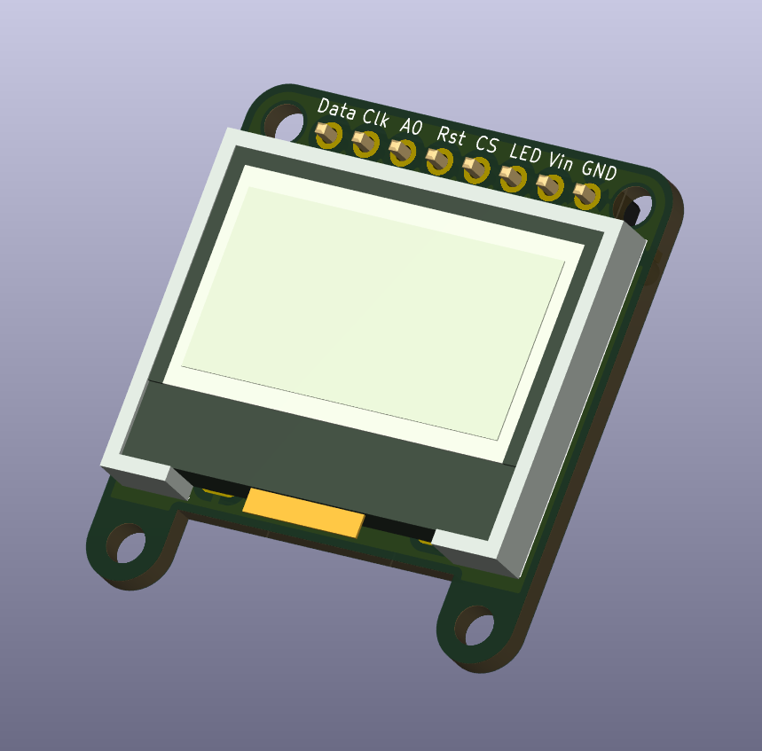
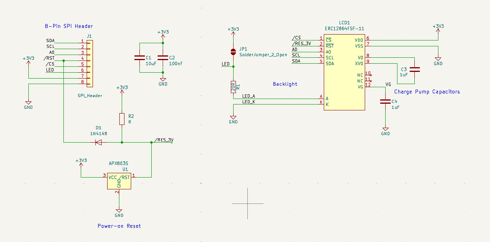
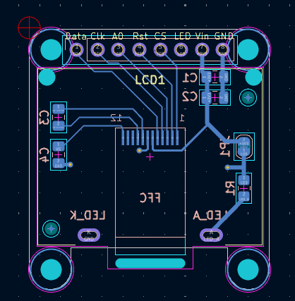
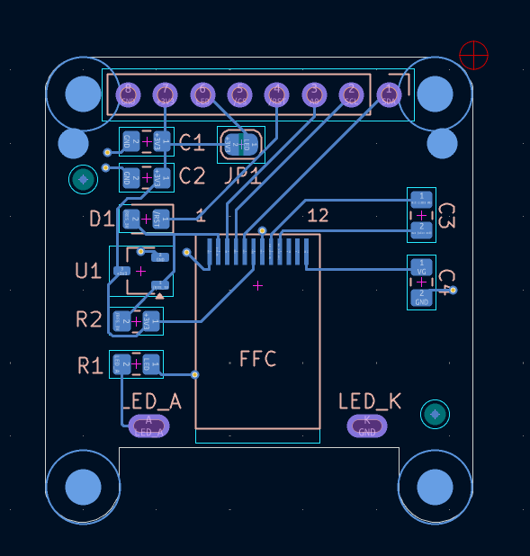
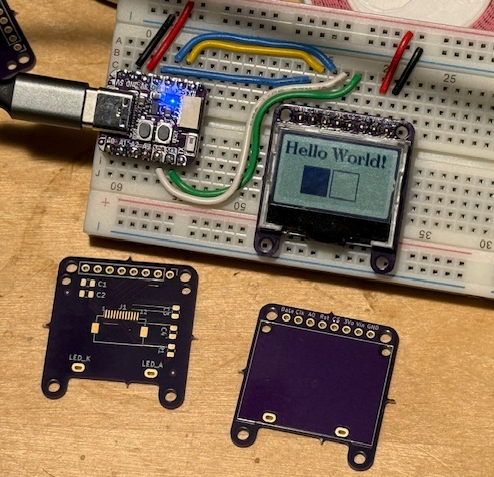

# COG Display Breakout

This is a breakout board for the **ERC12864FSF-11** COG (Chip On Glass) LCD module, a 0.96", 128x64 pixel display using an ST7567 controller and 4-wire SPI an interface. The PCB routes the display's inputs from its 12-pin FFC cable to a breadboard-friendly 2.54mm pin header. It also exposes the backlight LED pins and provides a few discrete components for LCD module.

It was designed to have a  form factor (~27x27mm, 4 mounting holes, pin headers) to like the Adafruit [0.96" OLED module](https://www.adafruit.com/product/326) and similar 1" displays.

LCD technology differs from the OLED displays commonly found on display boards of this size. LCD should be daylight readable like e-paper, but with simpler hardware and software requirements. However, LCDs may need a backlight in low-light conditions, so the breakout includes connections display's built-in LED with an option for always on operation. Contrast control is through software.




## Specifications

| Parameter | Value |
|-----------|-------|
| Display | [ERC12864FSF-11](https://www.buydisplay.com/0-96-inch-low-cost-white-128x64-graphic-cog-lcd-display-st7567-spi) (128x64, monochrome) |
| Controller | ST7567 |
| Interface | 4-wire SPI |
| Supply voltage | 3.3V only |
| Board size | ~27 x 27mm |
| Mounting | 4x M2 holes |

## Repository Structure

```
ArduinoCode/                             Example sketches for ESP32-C3
COGDisplayBreakout.pretty/               Custom footprint library
COGDisplayBreakout.3dmodels/             Custom 3D models
docs/                                    Datasheets, reference designs, tutorials
images/                                  Image assets
step/                                    3D models of the board and a small case
COGDisplayBreakout.kicad_sch             Schematic
COGDisplayBreakout.kicad_pcb             PCB layout
COGDisplayBreakout.kicad_sym             Custom symbol library
README.md
```

---

## Schematic and Board Layout

The KiCad 9 project files are at the repository root.

### Circuit Overview

The schematic connects the ERC12864FSF-11 display to an 8-pin SPI header (J1) with supporting passives:

**Header pinout (J1 - SPI_Header):**

| Pin | Signal | Description |
|-----|--------|-------------|
| 1 | SDA | SPI data (MOSI) |
| 2 | SCL | SPI clock |
| 3 | A0 | Data/command select (DC) |
| 4 | /RST | Reset (active low) |
| 5 | /CS | Chip select (active low) |
| 6 | LED | LED control |
| 7 | VDD | +3.3V supply |
| 8 | GND | Ground |

**Passive components:**

| Ref | Value | Purpose |
|-----|-------|---------|
| R1 | 20R | Backlight LED current-limiting resistor |
| C1 | 10uF |  VDD bypass capacitor|
| C2 | 100nF | VDD bypass capacitor |
| C3 | 1uF | Charge pump capacitor (V0 to XV0) |
| C4 | 1uF | Charge pump capacitor (V0 to GND) |

The ST7567's built-in voltage booster generates the LCD bias voltage using external capacitors C3, and C4. No regulator or level shifting is included; the board is 3.3V only. Capacitors C1 and C2 are for decoupling. The R1 value was taken from the reference design, but for 10-20 mA LED current it should be about 200 Ohms.



### PCB

This is a 2-layer board, ~27x27mm. The display's 12-pin FFC cable (0.6mm pitch) is soldered directly to SMD pads on the back side. The display module mounts flat against the front by means of plastic mounting pins on the display case and the solder tabs for the backlight LED. Four M2 mounting holes at the corners matching similar OLED modules.

The display's 12-pin FFC cable is a non-standard 0.6mm pitch, so must be soldered directly to pads on the breakout PCB.


PCB Front (ground plane copper hidden)


PCB Back

### Board Revisions

- **V0.1** (March 2026) - Initial prototype. Known issues: C1 wiring error, missing VG capacitor. See `AssemblyNotes.txt` for workarounds.

- **V0.2** (March 2026) - Fixed capacitor circuit. Known issue: backlight A/K pads swapped. See `AssemblyNotes.txt`.
Gerber files: V0.2 in `Gerbers20260323/`.

- **V1.0** (April 2026) - Fixed A/K pads and connected LED control to pin 6. See `AssemblyNotes.txt`.
Gerber files: V0.2 in `Gerbers20260403/`.


---

## Custom ERC12864FSF-11 KiCad Library

The project includes a custom schematic symbol, PCB footprint, and 3D model for the ERC12864FSF-11 display module. These are in project-local libraries referenced via `sym-lib-table` and `fp-lib-table`.

### Schematic Symbol

**File:** `COGDisplayBreakout.kicad_sym`
**Symbol name:** `ERC12864FSF-11`

12-pin FFC cable (0.6mm pitch, 19mm long) plus 2 backlight pins.

| Pin | Name | Type | Description |
|-----|------|------|-------------|
| 1 | ~{CS} | Input | Chip select (active low) |
| 2 | ~{RST} | Input | Reset (active low) |
| 3 | A0 | Input | Data/command select |
| 4 | SCL | Input | SPI clock |
| 5 | SDA | Input | SPI data (MOSI) |
| 6 | VDD | Power | +3.3V supply |
| 7 | VSS | Power | Ground |
| 8 | V0 | Passive | Contrast voltage (booster output) |
| 9 | XV0 | Passive | Booster capacitor tap |
| 10 | NC | - | Not connected |
| 11 | NC | - | Not connected |
| 12 | VG | Passive | Negative voltage for LCD bias |
| A | A | Passive | Backlight LED anode |
| K | K | Passive | Backlight LED cathode |

Note: The backlight pins (A, K) are separate solder tabs on the display module, not part of the 12-pin FFC cable.

### PCB Footprint

**File:** `COGDisplayBreakout.pretty/ERC12864FSF-11_COG_LCD.kicad_mod`

There is a lot going on with this component's footprint:
- 12 SMD pads at 0.6mm pitch for direct-solder FFC cable connection
- Module outline on front silkscreen
- Back silkscreen shows how the FFC cable would wrap around
- 2 through-hole oval pads for backlight pins (A and K)
- Two NPT holes for case aliment studs
- An NPT oval slot to pass the FFC cable to the back of the PCB 

The 12 SMD pads are a bit longer to allow some play when wrapping the FFC cable around to the back. The pads and oval slot are positioned relative to the stud holes and backlight pins so the FFC cable end is centered on the pads. 

Unfortunately, there does not seem to be an FFC/FPC connector available in 12-pin, 6mm pitch so it must be soldered to the PCB. A piece of Kapton tape over the solder joins will provide a bit of strain relief and protection from shorts. 
  
### 3D Model

**Directory:** `COGDisplayBreakout.3dmodels/`

| File | Format | Description |
|------|--------|-------------|
| `ERC12864FSF-11.step` | STEP | Solid body model for KiCad 3D viewer |
| `ERC12864FSF-11_COG_LCD.wrl` | VRML | Lightweight preview model |

The STEP model is referenced by the footprint and renders in KiCad's 3D viewer and to export the PCB with components as a 3D model.

---

## Arduino Code

Example sketches are in `ArduinoCode/`. The code should run on most modern Arduino board variants with sufficient pins and memory. The code currently targets the [**Adafruit QT Py ESP32-C3**](https://www.adafruit.com/product/5405) and uses the **U8g2** graphics library.

### Dependencies

- [U8g2](https://github.com/olikraus/u8g2) - Monochrome graphics library (handles ST7567 initialization, SPI transport, fonts, and drawing)
- SPI (built-in)

Install U8g2 via the Arduino IDE Library Manager.

### Pin Mapping (QT Py ESP32-C3 to breakout header)

| Display Signal | Header Pin | QT Py Pin | ESP32-C3 GPIO |
|----------------|------------|-----------|---------------|
| SCL (clock) | 1 | SCK | 10 |
| SDA (data) | 2 | MO | 7 |
| A0 (DC) | 3 | MI* | 8 |
| /RST | 4 | SDA* | 5 |
| /CS | 5 | tied to GND | - |
| LED | 6 | A3 | - |
| GND | 1 | GND | - |
| VDD | 2 | 3V3 | - |

*These I2C/SPI pins are repurposed as GPIO since the XIAO style boards have limited pins. The ERC12864 does not provide data out, so the MISO pin is used for Data/Control instead.

### Sketches

Here are some Arduino sketches that can be run on a XIAO style board like Adafruit's QT Py ESP32-C3 with the connections shown above



| Sketch | Description |
|--------|-------------|
| `ERC12864_Hello/` | Minimal hello-world with text and simple graphics. Also blinks the QT Py's NeoPixel. |
| `ERC12864_SPIDemo/` | AI Port of the manufacturer's C tutorial. Cycles through text, graphics primitives, XBM bitmap, and test patterns. Includes commented-out contrast adjustment code for future button support. |
| `GraphicsTest/` | U8g2 graphics test suite (from the U8g2 examples, configured for this display). |
| `ScrollingText/` | U8g2 scrolling text demo (from the U8g2 examples, configured for this display). |

### U8g2 Constructor

All sketches use the same U8g2 constructor. Identifies the display module by part number and the SPI interface pins. See mappings above.

```cpp
U8G2_ST7565_ERC12864_ALT_F_4W_SW_SPI u8g2(U8G2_R0,
    /* clock=*/ 10, /* data=*/ 7, /* cs=*/ U8X8_PIN_NONE, /* dc=*/ 8, /* reset=*/ 5);
```

- `ERC12864_ALT` - contrast-improved variant for this display
- `_F_` - full framebuffer mode (~1KB RAM)
- `4W_SW_SPI` - 4-wire software SPI

The 4-wire HW variants of the U8g2 constructors are intended for the platform's native SPI interface: MOSI, MISO, clock and chip select. Since this device is write only the MISO pin is repurposed for A0 (Data/Command select). The 4-wire SW constructor is used to support this pin mapping but others are possible.

/CS is tied to GND on the breakout board, so the display is always selected and no GPIO is needed for chip select. If sharing the SPI bus with other devices, connect /CS to a GPIO pin and replace `U8X8_PIN_NONE` with that pin number in the constructor.

---

## Reference Documentation

Datasheets and reference material are in `docs/`:

- `ERC12864-11_Datasheet.pdf` - Display module datasheet
- `ST7567_V1.7.pdf` - Controller IC datasheet
- `ERC12864FSF-11_Display.md` - Display specifications summary
- `ERC12864FSF-11_SPI_Reference_Design.md` - Wiring guide and U8g2 examples
- `ERC12864-11_Tutorial/` - Manufacturer's C code tutorial and interface schematic

## Tools

- **KiCad 9** for schematic and PCB design
- **Arduino IDE** with ESP32 board support for firmware development
- **U8g2** library for display graphics
